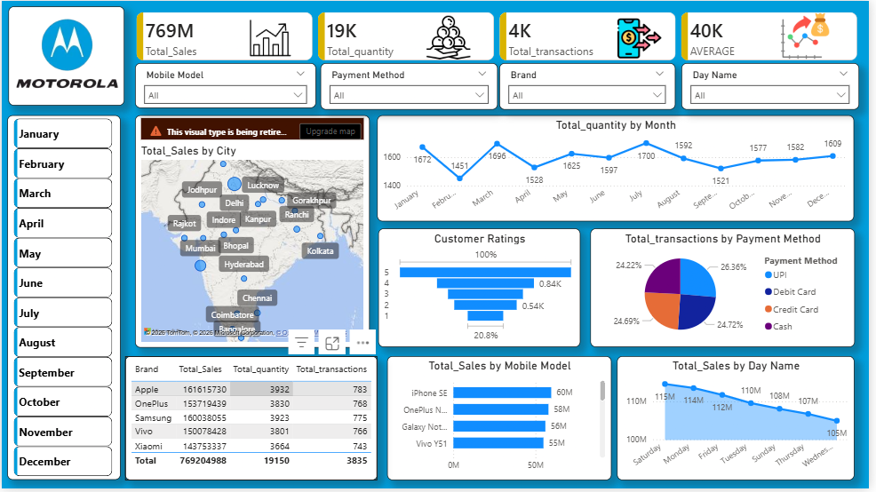

# 📊 Motorola Sales Dashboard | Power BI

> An interactive Business Intelligence dashboard built using Power BI to analyze Motorola sales data and transform raw datasets into actionable business insights through data cleaning, modeling, DAX calculations, and dynamic visualizations.

---

## 📌 Project Overview

The **Motorola Sales Dashboard** is an end-to-end Business Intelligence project developed in **Microsoft Power BI**. The dashboard transforms raw sales data into meaningful insights that help monitor business performance, identify sales trends, evaluate product performance, and support data-driven decision-making.

The project demonstrates the complete analytics workflow, including data extraction, cleaning, transformation, data modeling, DAX calculations, and dashboard development.

---

## 🎯 Business Objective

The objective of this dashboard is to provide business stakeholders with an interactive platform to monitor sales performance and answer key business questions, including:

- 💰 What is the total sales revenue?
- 📦 How many products were sold?
- 🛒 How many transactions were completed?
- 📱 Which mobile models generate the highest sales?
- 🏷 Which Motorola models are the top performers?
- 💳 Which payment methods are preferred by customers?
- 📈 How do monthly sales trends change over time?
- 🌍 Which cities contribute the highest revenue?
- ⭐ How do customer ratings vary across products?
- 📅 Which day of the week generates the highest sales?

---

# 🛠 Tech Stack

- Microsoft Power BI
- Power Query
- DAX (Data Analysis Expressions)
- Data Modeling
- Data Cleaning
- Data Transformation
- Data Visualization

---

# 📈 Dashboard Features

## 📊 KPI Cards

- Total Sales
- Total Quantity Sold
- Total Transactions
- Average Sales

---

## 📉 Interactive Visualizations

- Monthly Sales Trend
- Sales by Mobile Model
- Sales by Brand
- City-wise Sales Analysis (Map)
- Sales by Day of Week
- Payment Method Distribution
- Customer Ratings Analysis
- Brand Performance Table

---

## 🎛 Interactive Filters

- Brand
- Mobile Model
- Payment Method
- Date

---

# 📊 Skills Demonstrated

- Data Cleaning
- Data Transformation
- Power Query
- DAX Measures
- Data Modeling
- KPI Development
- Interactive Dashboard Design
- Business Intelligence
- Data Visualization
- Analytical Thinking
- Dashboard Storytelling

---

# 📷 Dashboard Preview




---

# 💡 Key Insights

The dashboard enables businesses to:

- Monitor overall sales performance.
- Identify top-selling Motorola smartphone models.
- Compare sales across different cities.
- Analyze customer purchasing behavior.
- Evaluate payment preferences.
- Track monthly sales growth.
- Measure customer satisfaction through ratings.
- Support strategic business decisions using interactive visualizations.

---

# 📚 What I Learned

This project strengthened my practical understanding of:

- Data Cleaning using Power Query
- Data Transformation techniques
- Data Modeling in Power BI
- Writing DAX Measures
- KPI Development
- Dashboard Design Best Practices
- Business Intelligence Reporting
- Data Storytelling through Visualizations

---

# 🚀 Future Enhancements

- Forecasting and Trend Analysis
- Drill-through Reports
- Dynamic Tooltips
- Profit Margin Analysis
- Customer Segmentation
- Time Intelligence using DAX
- Power BI Service Deployment

---

# 📂 Repository Structure

```
Motorola-Sales-Dashboard/
│
├── Dashboard.pbix
├── Dataset/
├── Dashboard Images/
├── README.md
└── LICENSE
```

---

# 👨‍💻 About Me

Hi, I'm **Aditya Kumar**, an aspiring **Data Analyst** passionate about transforming data into meaningful business insights.

### Currently working with:

- 📊 Power BI
- 🐍 Python
- 🗄 SQL
- 📈 Excel
- 📉 Statistics
- 📚 Data Visualization

I'm continuously building real-world data analytics projects to strengthen my analytical and business intelligence skills.

⭐ If you found this project helpful, consider giving it a **Star**!

